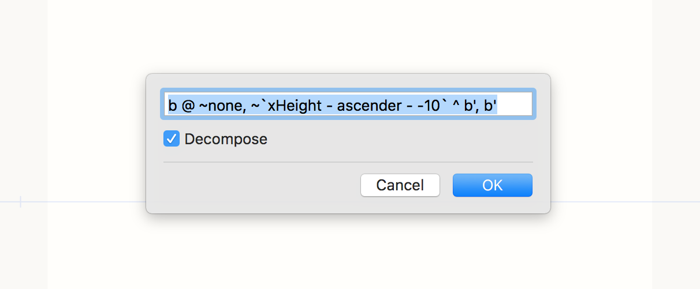

# Lazy Bones

*Note: this has only been lightly tested so far. Please report any bugs. Thanks!*

This extension lets you define constructions for starting glyphs. For example, if you are starting the *q,* this will add the outline from the *b,* rotate it and position it. Then, you can use that as the starting point for the *q.* In other words, this gives lazy designers the bones for starting a glyph.

## Documentation

In the text field there will be a glyph construction. Use the amazing [Glyph Construction](https://github.com/typemytype/GlyphConstruction) syntax, but don't enter the `=` part of the syntax here. Check the _Decompose_ check box if you want the components decomposed.

### Your Own Settings

Are coming soon-ish.

#### Pre-Built Variables

| `overshootLowercase` | Calculated as the bottom of the bounds of the "o"  |
| `overshootUppercase` | Calculated as the bottom of the bounds of the "O" |
